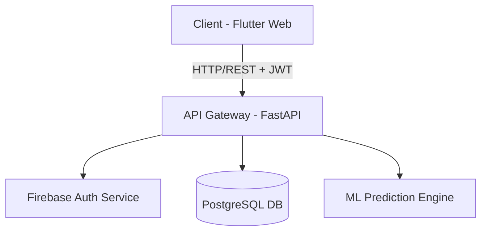

# Smart Energy AI - Architecture Guide

## System Overview
The platform uses a decoupled microservices-inspired architecture:

### 1. Frontend Layer
- **Framework**: Flutter Web
- **State Management**: Riverpod
- **Routing**: GoRouter
- **Design System**: Material 3 (Custom ThemeProvider)

### 2. API Gateway & Backend Layer
- **Framework**: FastAPI (Python)
- **Security**: Firebase JWT Authentication Middleware
- **Rate Limiting**: `slowapi`
- **Caching**: `cachetools` (TTLCache)

### 3. Data & ML Layer
- **Database**: PostgreSQL (Production) / SQLite (Local)
- **ORM**: SQLAlchemy
- **ML Model**: Serialized `model.pkl` loaded into FastAPI state via `lifespan`.

### 4. CI/CD & Cloud Infrastructure
- **Frontend Hosting**: Firebase Hosting
- **Backend Hosting**: Render
- **Pipeline**: GitHub Actions

