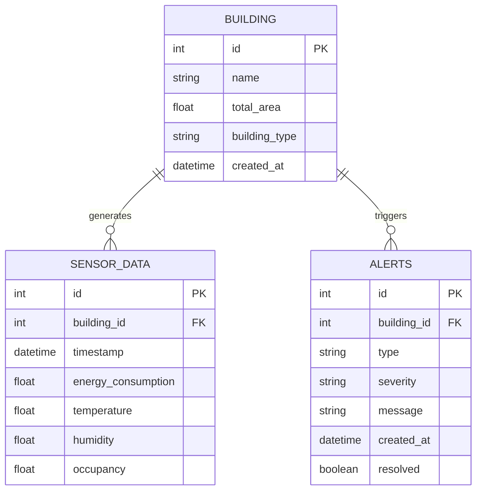

# Smart Energy AI - Database ER Diagram

```mermaid
erDiagram
    BUILDING ||--o{ SENSOR_DATA : generates
    BUILDING ||--o{ ALERTS : triggers
    
    BUILDING {
        int id PK
        string name
        float total_area
        string building_type
        datetime created_at
    }

    SENSOR_DATA {
        int id PK
        int building_id FK
        datetime timestamp
        float energy_consumption
        float temperature
        float humidity
        float occupancy
    }

    ALERTS {
        int id PK
        int building_id FK
        string type
        string severity
        string message
        datetime created_at
        boolean resolved
    }
```
