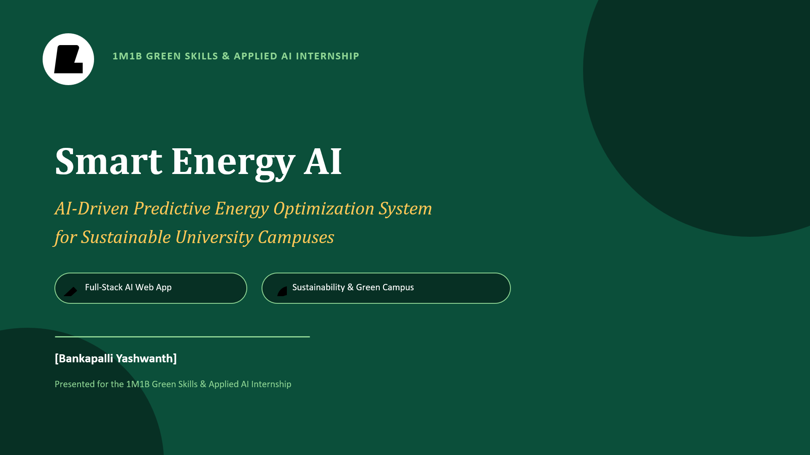
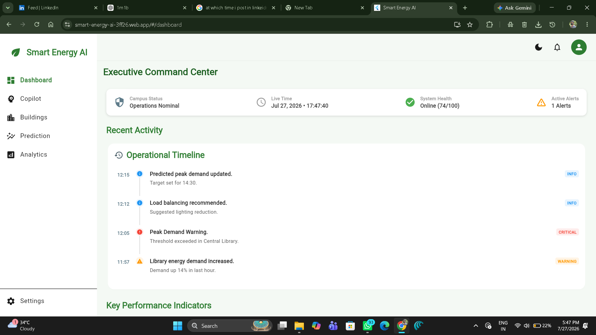
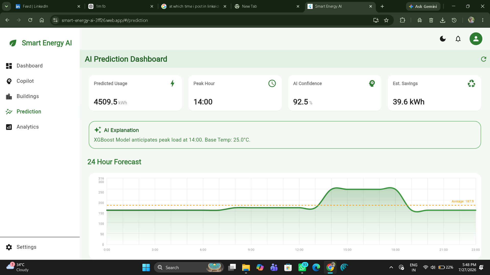
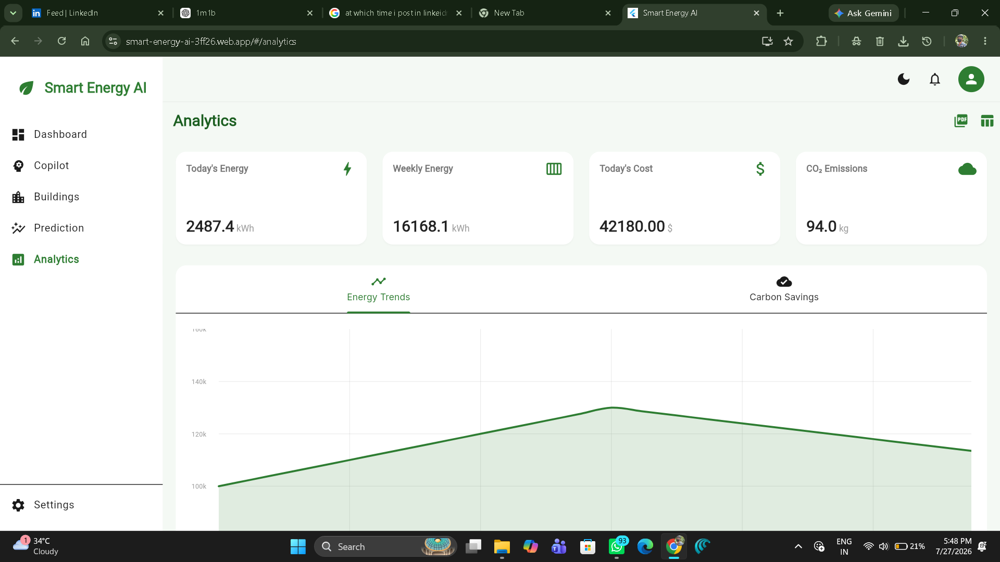

# ⚡ Smart Energy AI

## AI-Driven Predictive Energy Optimization System for Sustainable University Campuses
<p align="center">
  
</p>
<p align="center">
  
  
  
  
  
</p>

---

## 📖 Overview

Smart Energy AI is a full-stack AI-powered web application designed to support intelligent energy management for university campuses.

The system combines machine learning, cloud technologies, and interactive dashboards to help institutions monitor energy usage, analyze historical trends, estimate future consumption, and promote sustainable energy practices.

This project was developed as part of the **1M1B Green Skills & Applied AI Internship**.

---

# 🚀 Problem Statement

Many educational institutions monitor electricity consumption only after receiving monthly electricity bills.

This approach creates several challenges:

- Limited visibility into daily energy usage
- Difficulty identifying abnormal energy consumption
- No predictive planning for future demand
- Higher operational costs
- Reduced energy efficiency

Smart Energy AI addresses these challenges through an AI-assisted predictive energy management platform.

---

# ✨ Features

- 🔐 Secure Firebase Authentication
- 📊 Executive Dashboard
- 🏢 Building-wise Energy Monitoring
- 🤖 AI-based Energy Consumption Prediction
- 📈 Historical Analytics & Visualization
- 💡 AI-assisted Energy Recommendations
- 🌱 Sustainability Indicators
- 📱 Responsive Flutter Web Interface

---
## 📸 Screenshots

### Dashboard

<p align="center">
  
</p>

### Prediction

<p align="center">
  
</p>

### Analytics

<p align="center">
  
</p>

---

# 🏗️ System Architecture

```
                User

                  │

                  ▼

         Flutter Web Frontend

                  │

                  ▼

     Firebase Authentication

                  │

                  ▼

          FastAPI Backend

         ┌────────┴─────────┐

         ▼                  ▼

 Machine Learning      Firestore Database

         └────────┬─────────┘

                  ▼

      Dashboard & Analytics
```

---

# 🔄 Application Workflow

```
Login

↓

Authentication

↓

Dashboard

↓

Energy Data

↓

Prediction Request

↓

Machine Learning

↓

Analytics

↓

Recommendations

↓

User Dashboard
```

---

# 🛠️ Technology Stack

## Frontend

- Flutter Web
- Dart
- Material 3

---

## Backend

- FastAPI
- Python

---

## Machine Learning

- Scikit-learn
- Pandas
- NumPy

---

## Authentication

- Firebase Authentication

---

## Database

- Firebase Firestore

---

## Deployment

- Firebase Hosting
- Render

---

## Development Tools

- Visual Studio Code
- Git
- GitHub

---

# 🤖 Machine Learning Pipeline

The prediction module follows the workflow below:

```
Historical Energy Data

↓

Data Preparation

↓

Feature Engineering

↓

Model Loading

↓

Prediction

↓

Dashboard Display
```

The machine learning model estimates future campus energy consumption using historical energy-related data.

---

# 📂 Project Structure

```
Smart-Energy-AI/

│

├── frontend/

│ ├── lib/

│ ├── assets/

│ └── web/

│

├── backend/

│ ├── api/

│ ├── models/

│ ├── services/

│ └── ml/

│

├── docs/

│

├── README.md

└── render.yaml
```

---

# 🔐 Security

- Firebase Authentication
- Protected API endpoints
- Token validation
- Backend authorization
- Secure REST communication

---

# 📊 Key Modules

## Dashboard

Displays:

- Campus overview
- Live operational status
- KPIs
- Timeline
- Alerts

---

## Buildings

Displays:

- Building-wise energy information
- Consumption overview

---

## Prediction

Provides:

- Future energy prediction
- Peak hour estimation
- AI confidence
- Estimated savings

---

## Analytics

Visualizes:

- Daily energy
- Weekly energy
- Cost trends
- Carbon emissions
- Historical charts

---

## Recommendations

Provides AI-assisted suggestions to improve campus energy efficiency.

---

# 🌍 Sustainability Impact

The project contributes towards:

- Better energy awareness
- Efficient energy planning
- Reduced unnecessary consumption
- Improved operational efficiency

Supports:

- SDG 7 — Affordable & Clean Energy
- SDG 9 — Industry, Innovation & Infrastructure
- SDG 11 — Sustainable Cities & Communities
- SDG 13 — Climate Action

---

# 🚀 Future Enhancements

- Real-time IoT integration
- Smart meter connectivity
- Mobile application
- Advanced forecasting models
- Multi-campus deployment

---

# 🎥 Demo

## Live Application

https://YOUR-LIVE-LINK

---

## Demo Video

https://YOUR-YOUTUBE-LINK

---

## Presentation

https://YOUR-PRESENTATION-LINK

---

# ⚙️ Installation

Clone the repository

```bash
git clone https://github.com/yashwanth15-15/Smart-Energy-AI.git
```

Frontend

```bash
cd frontend
flutter pub get
flutter run
```

Backend

```bash
cd backend
pip install -r requirements.txt
uvicorn main:app --reload
```

---

# 👨‍💻 Author

## Bankapalli Yashwanth

B.Tech Computer Science & Engineering

Acharya Nagarjuna University

GitHub:
https://github.com/yashwanth15-15

LinkedIn:
https://www.linkedin.com/in/YOUR-LINKEDIN

---

# 🙏 Acknowledgements

This project was developed as part of the **1M1B Green Skills & Applied AI Internship**.

Special thanks to the mentors, organizers, and the open-source community for providing valuable learning resources and guidance.

---

# ⭐ If you found this project interesting, consider giving it a Star!
